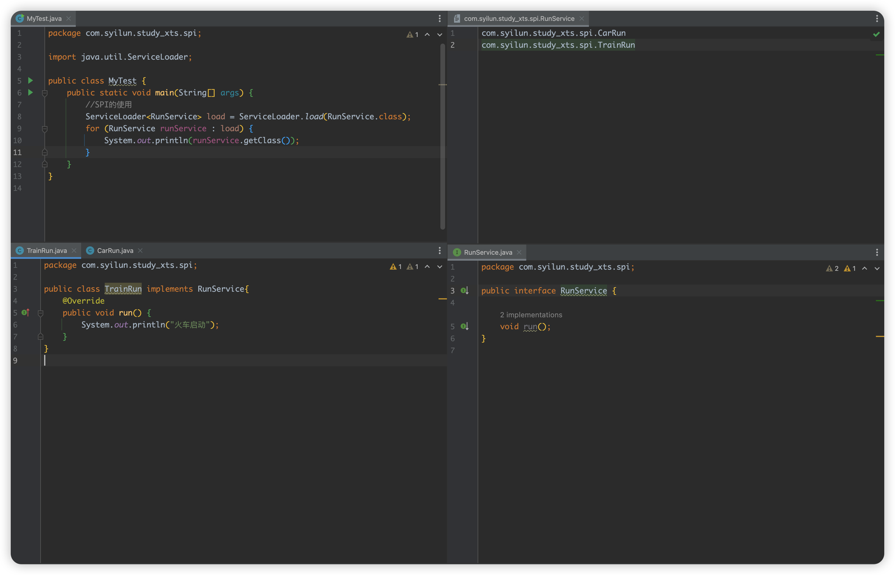
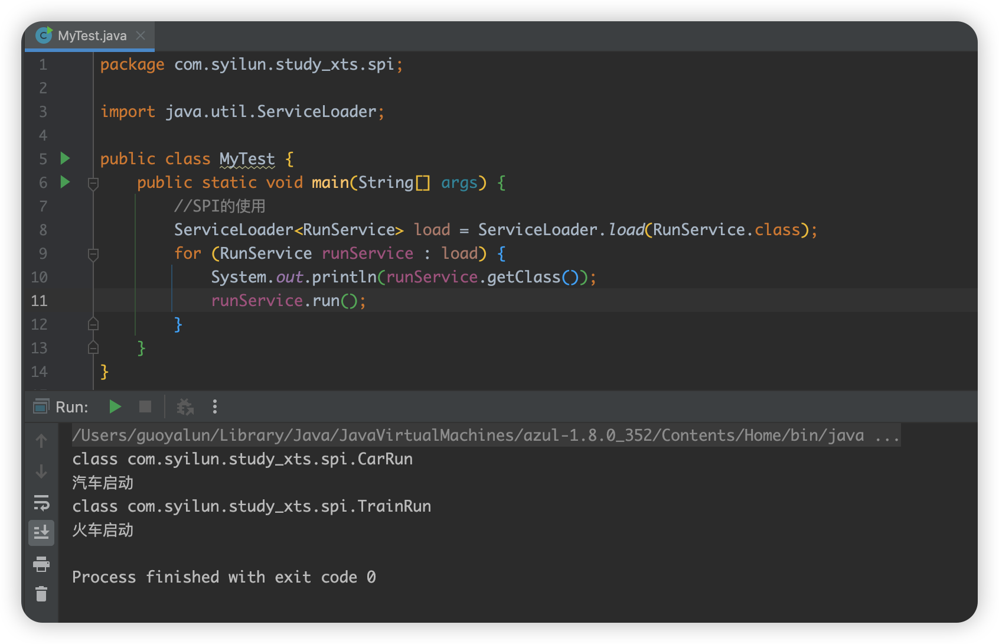
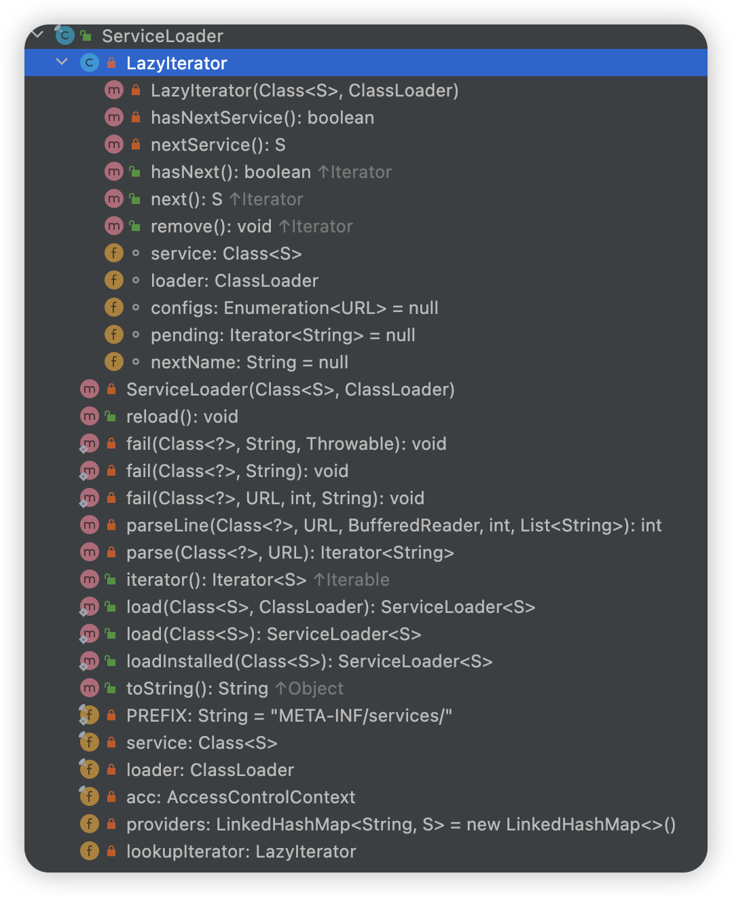
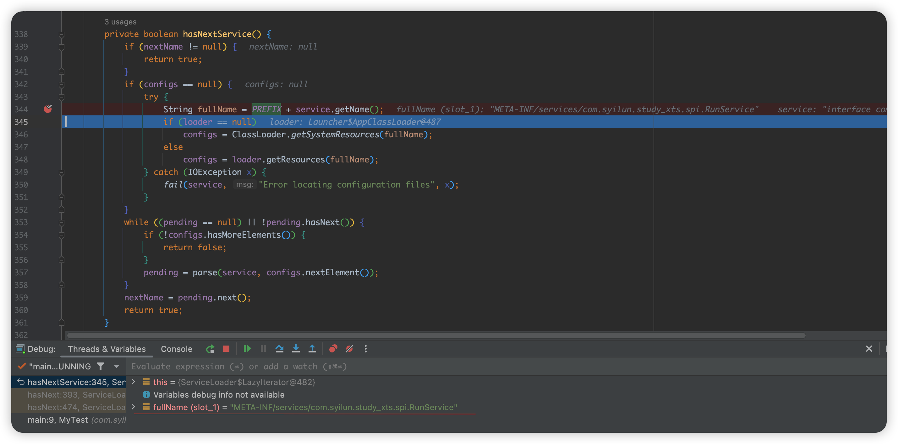
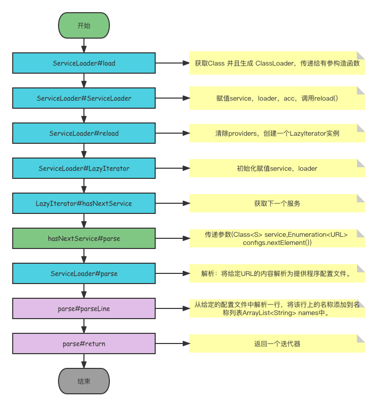
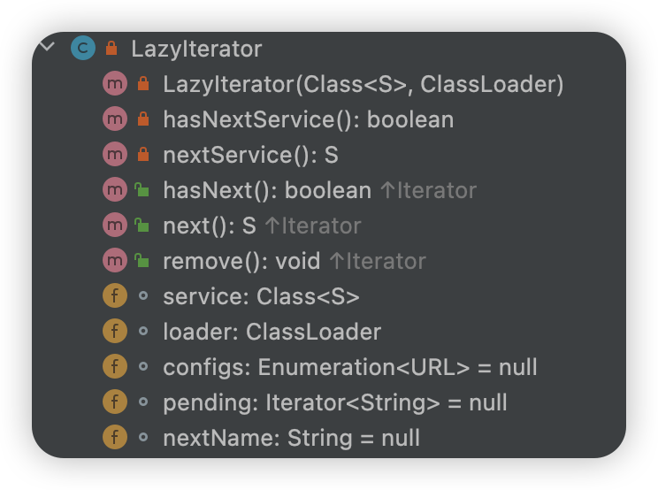

# SPI
## SPI 简介
`SPI` 全称是 `Service Provider Interface`，是一种 `JDK` 内置的动态加载实现扩展点的机制，通过 `SPI` 技术我们可以动态获取接口的实现类，不用自己来创建。

## SPI的具体细节:
- 接口：需要有一个功能接口；
- 实现类：接口只是规范，具体的执行需要有实现类才行，所以不可缺少的需要有实现类；
- 配置文件：要实现 `SPI` 机制，必须有一个与接口同名的文件存放于类路径下面的  `META-INF/services` 文件夹中，并且文件中的每一行的内容都是一个实现类的全路径；
- 类加载器 `ServiceLoader`：`JDK` 内置的一个类加载器，用于加载配置文件中的实现类；

## 创建代码测试
因为代码非常简单,就补贴代码了,只贴上截图


测试结果展示


可以看到正常的获取到了接口的实现类，并且可以直接使用实现类的run()方法。


## 粗略的瞅瞅源码?
从`java.util.ServiceLoader.load()` 进去, 可以看到内部结构如下


### 看看常量
```java
    //前缀
    private static final String PREFIX = "META-INF/services/";

    // The class or interface representing the service being loaded
    // 表示正在加载的服务的类或接口
    private final Class<S> service;

    // The class loader used to locate, load, and instantiate providers
    // 用于定位、加载和实例化提供程序的类加载器
    private final ClassLoader loader;

    // The access control context taken when the ServiceLoader is created
    // 创建ServiceLoader时获取的访问控制上下文
    private final AccessControlContext acc;

    // Cached providers, in instantiation order
    // 缓存的提供程序，按实例化顺序
    private LinkedHashMap<String,S> providers = new LinkedHashMap<>();

    // The current lazy-lookup iterator
    // 当前的延迟查找迭代器
    private LazyIterator lookupIterator;
```
发现有一个`PREFIX`,这也解释了为什么配置文件要放在`META-INF/services`文件夹中了.因为会从这个路径里面去读取文件做处理.那么在哪里用到了这个`PREFIX`呢,通过搜索发现,它是在`LazyIterator`(延迟查找迭代器)中被使用到了.

debug来验证一下:

的确是在`fullName`处获取到了`SPI`配置文件的全路径.

## 走一下大概的流程(大概大概)



### 1.进入1个参数的load方法
```java
public static <S> ServiceLoader<S> load(Class<S> service) {
    //创建一个线程,获取一个类加载器
        ClassLoader cl = Thread.currentThread().getContextClassLoader();
        return ServiceLoader.load(service, cl);
    }
```

### 2.进入2个参数的load方法
```java
public static <S> ServiceLoader<S> load(Class<S> service,
                                            ClassLoader loader)
    {
        return new ServiceLoader<>(service, loader);
    }
```

### 3.跳转ServiceLoader有参构造函数,给service,loader,acc进行赋值操作(3个变量代表的意思上文有).赋值完后调用了reload()方法.
```java
private ServiceLoader(Class<S> svc, ClassLoader cl) {
        service = Objects.requireNonNull(svc, "Service interface cannot be null");
        loader = (cl == null) ? ClassLoader.getSystemClassLoader() : cl;
        acc = (System.getSecurityManager() != null) ? AccessController.getContext() : null;
        reload();
    }
```
### 4.reload方法
```java
 public void reload() {
     //清除此加载程序的提供程序缓存，以便重新加载所有提供程序。
        providers.clear();
        //调用此方法后，该方法的后续调用将延迟查找并实例化
        lookupIterator = new LazyIterator(service, loader);
    }
```
### 5.进入LazyIterator
在`ServiceLoader`中构造了一个迭代器,内部构造如下


#### 5.1先赋值操作
```java
private LazyIterator(Class<S> service, ClassLoader loader) {
            this.service = service;
            this.loader = loader;
        }
```

#### 5.2调用hasNextService方法.我只贴出了个人认为比较重要的代码(精简一下),详细代码可以自行去源码查看.
```java
private boolean hasNextService() {
    //Enumeration<URL> configs 如果为空
        if (configs == null) 
        //通过PREFIX + 类名 拼接成全路径
            String fullName = PREFIX + service.getName();
            //通过全路径获取一个枚举类<URL>
            configs = loader.getResources(fullName);
        }
        //调用parse方法进行解析,获取一个迭代器<String>
        pending = parse(service, configs.nextElement());
        //获取下一个名称
        nextName = pending.next();
        return true;
    }
```

### 6.parse方法,我只贴出了个人认为比较重要的代码(精简一下),详细代码可以自行去源码查看.
```java
private Iterator<String> parse(Class<?> service, URL u) throws ServiceConfigurationError {
    //1.创建一个名为names的数组列表
        ArrayList<String> names = new ArrayList<>();
        //2.while循环调用parseLine,从给定的配置文件中解析一行，将该行上的名称添加到names列表中。
        while ((lc = parseLine(service, u, r, lc, names)) >= 0) ;
        //3.返回names这个数组列表的迭代器
        return names.iterator();
    }
```

#### 6.1瞅瞅parseLine方法,老样子,精简一下
```java
    private int parseLine(Class<?> service, URL u, BufferedReader r, int lc, List<String> names) throws IOException, ServiceConfigurationError {
        String ln = r.readLine();
        if (ln == null) {
            return -1;
        }
        //省略期间对ln的复杂操作...
        
        //做个判断，providers(一个LinkedHashMap) 和  names 都不包含ln，那就直接把ln添加进names中
        if (!providers.containsKey(ln) && !names.contains(ln)) names.add(ln);
        return lc + 1;
    }
```
然后,,,好像就完了,差不多就是这么个流程.