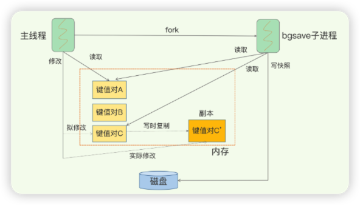

# 内存快照(RDB)

`Redis` 持久化有两种方法，一种是 `AOF` 日志，另外一种就是：内存快照（就是指内存中的数据在某一个时刻的状态记录）。

对 `Redis` 来说，它实现类似照片记录效果的方式，就是把某一时刻的状态以文件的形式写到磁盘上，也就是快照。这样一来，即使宕机，快照文件也不会丢失，数据的可靠性也就得到了保证。这个快照文件就称为 `RDB` 文件，其中， `RDB` 就是 `Redis DataBase` 的缩写。

**和 AOF 相比，RDB 记录的是某一时刻的数据，并不是操作。**

看上去 `RDB` 很优秀，但是，`RDB` 也存在几个问题：
1. 对哪些内存数据做快照？
2. 做快照的同时，数据还能被增删改嘛？

## 给哪些内存数据做快照？
`Redis` 的数据都在内存中，为了提供所有数据的可靠性保证，它执行的是全量快照，也就是说，把内存中的所有数据都记录到磁盘中。同样，给内存的全量数据做快照，把它们全部写入磁盘也会花费很多时间。而且，全量数据越多， `RDB` 文件就越大，往磁盘上写数据的时间开销就越大。

## 写入RDB文件会阻塞主线程嘛？
`Redis` 是单线程模型，为了避免阻塞主线程的操作，就要考虑该操作是否会阻塞主线程。 `Redis` 提供了两个命令来生成 `RDB` 文件，分别是：
- `save`：在主线程中执行，会导致阻塞；
- `bgsave`：创建一个子进程，专门用于写入 `RDB` 文件，避免了主线程的阻塞，这也是 `Redis` `RDB` 文件生成的默认配置。

## 快照时数据能修改嘛？

> 为了快照而暂停写操作，肯定是不能接受的。所以这个时候， `Redis` 就会借助操作系统提供的写时复制技术（`Copy-On-Write`, `COW`），在执行快照的同时，正常处理写操作。

`bgsave` 子进程是由主线程 `fork` 生成的，可以共享主线程的所有内存数据。 `bgsave` 子进程运行后，开始读取主线程的内存数据，并把它们写入 `RDB` 文件。此时，根据数据的操作类型（读/写）来做不同的处理：
- 如果主线程对这些数据也都是读操作（例如图中的键值对 A），那么，主线程和 `bgsave` 子进程相互不影响。
- 如果主线程要修改一块数据（例如图中的键值对 C），那么，这块数据就会被复制一份，生成该数据的副本（键值对 C’）。然后，主线程在这个数据副本上进行修改。同时， `bgsave` 子进程可以继续把原来的数据（键值对 C）写入 `RDB` 文件。

这样既保证了快照的完整性，也允许主线程同时对数据进行修改，避免了对正常业务的影响。

## 可以每秒做一次快照吗？

>内存快照，是把某一时刻的状态以文件的形式写到磁盘上，快照间隔的时间，决定了丢失数据的多少。

所以，要想尽可能恢复数据，快照间隔时间就要尽可能小，间隔时间越小，就越像“连拍”。那么，是不是可以每秒做一次快照？（毕竟，每次快照都是由 `bgsave` 子进程在后台执行，也不会阻塞主线）程。

**答案是不行！**

因为，虽然 `bgsave` 执行时不阻塞主线程，但是，如果频繁地执行全量快照，也会带来两方面的开销：
- 频繁将全量数据写入磁盘，会给磁盘带来很大压力，多个快照竞争有限的磁盘带宽，前一个快照还没有做完，后一个又开始做了，容易造成恶性循环。
- `bgsave` 子进程需要通过 `fork` 操作从主线程创建出来。虽然，子进程在创建后不会再阻塞主线程，但是， `fork` 这个创建过程本身会阻塞主线程，而且主线程的内存越大，阻塞时间越长。如果频繁 `fork` 出 `bgsave` 子进程，这就会频繁阻塞主线程了（所以，在 `Redis` 中如果有一个 `bgsave` 在运行，就不会再启动第二个 `bgsave` 子进程）。

**不能频繁的进行全量快照，快照间隔时间太长，一旦宕机，会丢失大量数据，该怎么办呢？**

>做增量快照，所谓增量快照，就是指，做了一次全量快照后，后续的快照只对修改的数据进行快照记录，这样可以避免每次全量快照的开销。如果我们对每一个键值对的修改，都做个记录，那么，如果有 1 万个被修改的键值对，就需要有 1 万条额外的记录。这对于内存资源宝贵的 `Redis` 来说，有些得不偿失。

到此，可以发现跟 `AOF` 相比，快照的恢复速度快，但是，快照的频率不好把握：
- 如果频率太低，两次快照间一旦宕机，就可能有比较多的数据丢失；
- 如果频率太高，又会产生额外开销。

**这也有问题，那也有问题，那咋办呢？继续往下看👇🏻**

## 混合持久化方式
`Redis 4.0` 中提出了一个混合使用 `AOF` 日志和内存快照的方法。简单来说，内存快照以一定的频率执行，在两次快照之间，使用 `AOF` 日志记录这期间的所有命令操作。

这个方法既能享受到 RDB 文件快速恢复的好处，又能享受到 AOF 只记录操作命令的简单优势（在实际业务中可以考虑使用这种持久化方式）。

## AOF 与 RDB 的选择建议
- 数据不能丢失时，内存快照和 `AOF` 的混合使用是一个很好的选择；
- 如果允许分钟级别的数据丢失，可以只使用 `RDB` ；
- 如果只用 `AOF` ，优先使用 `everysec` 的配置选项，因为它在可靠性和性能之间取了一个平衡。
