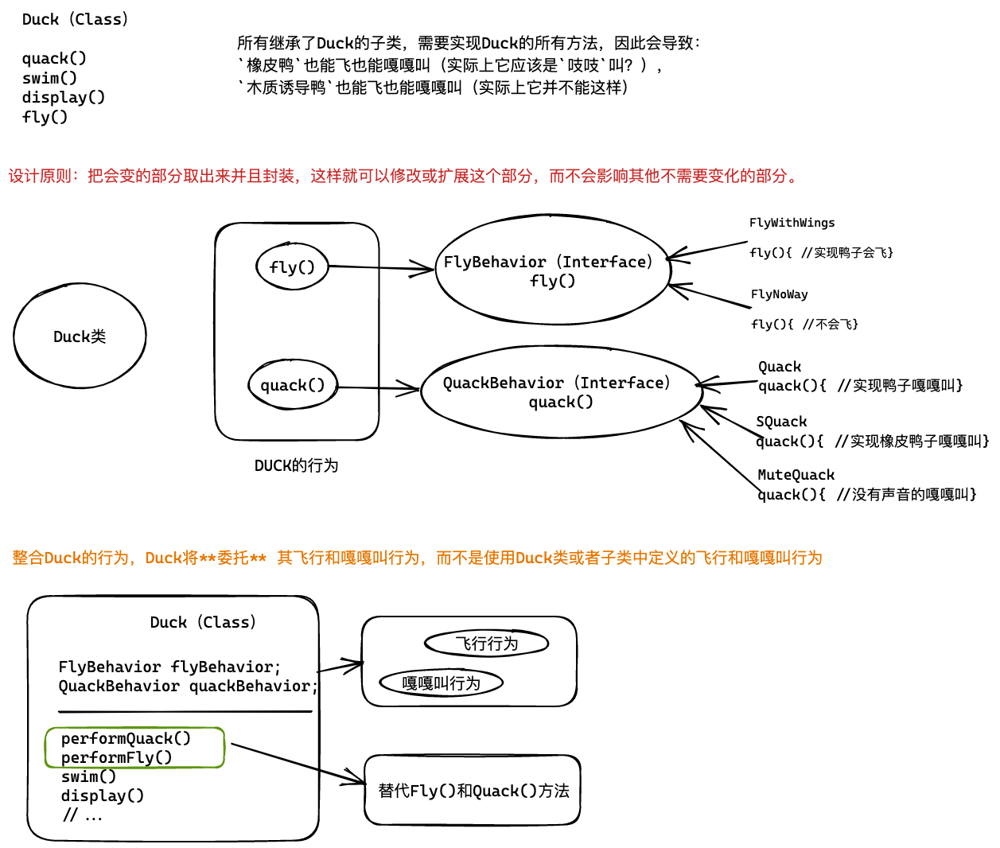
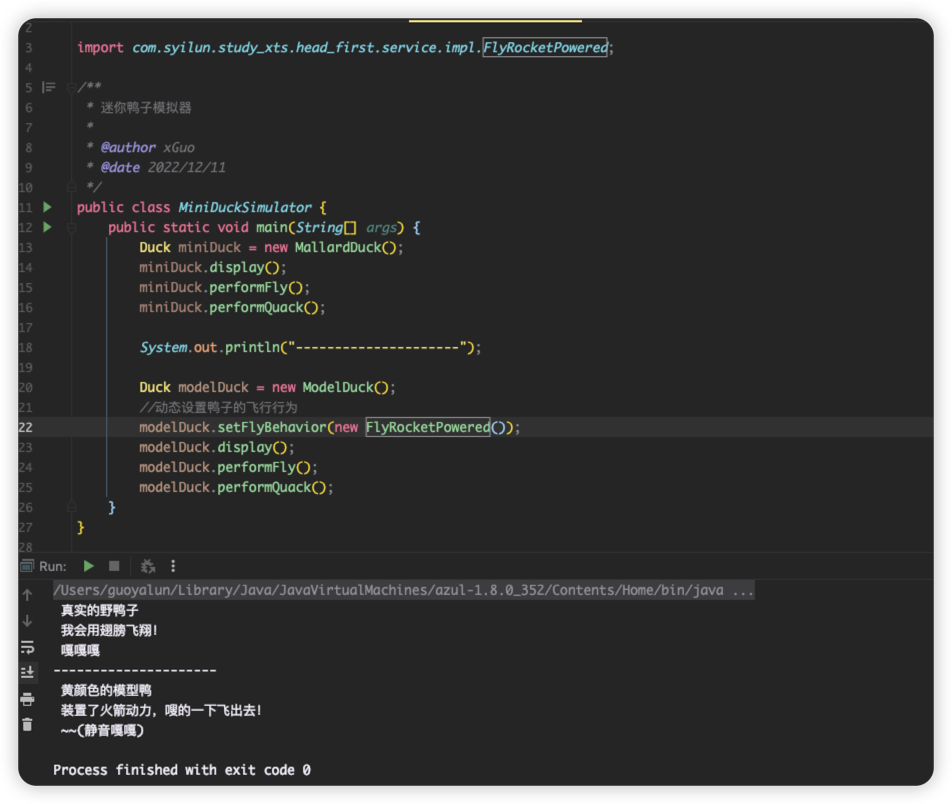

# 策略模式

需要设计一款鸭塘模拟器的游戏,然后会出现各式各样的鸭子,要能够增加各种不同地行为方式,比如会游泳,会叫,会飞,会升级???
一开始设计了一个Duck超类,然后其他的鸭子类型继承于它.但是利用继承来达到复用的目的,当需要为鸭子们提供新的行为方式可能就不那么美好了(正如我下图中黑体文字描述的一样).

# 大致内容图形化


# 代码演示
## 鸭子超类与它的子类
### Duck
```java

import com.syilun.study_xts.head_first.service.FlyBehavior;
import com.syilun.study_xts.head_first.service.QuackBehavior;

/**
 * 鸭子(超类）
 *
 * @author xGuo
 * @date 2022/12/11
 */
public abstract class Duck {

    /**
     * 飞行行为接口
     */
    FlyBehavior flyBehavior;

    /**
     * 嘎嘎行为接口
     */
    QuackBehavior quackBehavior;

    public Duck() {

    }

    /**
     * 显示的样子
     */
    public abstract void display();

    /**
     * 游泳
     */
    public void swim(){
        System.out.println(" 所有的鸭子都会漂浮起来 ");
    }

    /**
     * 执行嘎嘎方法
     */
    public void performQuack(){
        quackBehavior.quack();

    }

    /**
     * 执行飞行方法
     */
    public void performFly() {
        flyBehavior.fly();
    }


    //====== 添加动态设置行为 ======//

    public void setFlyBehavior(FlyBehavior flyBehavior) {
        this.flyBehavior = flyBehavior;
    }

    public void setQuackBehavior(QuackBehavior quackBehavior) {
        this.quackBehavior = quackBehavior;
    }
}

```

### MallardDuck(子类)
```java
package com.syilun.study_xts.head_first;

import com.syilun.study_xts.head_first.service.impl.FlyWithWings;
import com.syilun.study_xts.head_first.service.impl.Quack;

/**
 * 野鸭
 *
 * @author xGuo
 * @date 2022/12/11
 */
public class MallardDuck extends Duck {

    /**
     * 当MallardDuck被实例化时，构造器初始化MallardDuck继承来的quackBehavior和flyBehavior
     * 注意: MallardDuck的quackBehavior和flyBehavior变量是从Duck类继承过来的
     */
    public MallardDuck() {
        quackBehavior = new Quack();
        flyBehavior = new FlyWithWings();
    }

    @Override
    public void display() {
        System.out.println(" 真实的野鸭子 ");
    }
}

```


### ModelDuck(子类)
```java
package com.syilun.study_xts.head_first;

import com.syilun.study_xts.head_first.service.impl.FlyNoWay;
import com.syilun.study_xts.head_first.service.impl.MuteQuack;

/**
 * 模型鸭
 *
 * @author xGuo
 * @date 2022/12/11
 */
public class ModelDuck extends Duck{

    /**
     * 当ModelDuck被实例化时，构造器初始化ModelDuck继承来的quackBehavior和flyBehavior
     * 注意: ModelDuck的quackBehavior和flyBehavior变量是从Duck类继承过来的
     */
    public ModelDuck() {
        quackBehavior = new MuteQuack();
        flyBehavior = new FlyNoWay();
    }

    @Override
    public void display() {
        System.out.println(" 黄颜色的模型鸭 ");
    }
}
```

## 飞行行为接口与它的实现类
### FlyBehavior(Interface)
```java
package com.syilun.study_xts.head_first.service;

/**
 * 飞行行为
 *
 * @author xGuo
 * @date 2022/12/11
 */
public interface FlyBehavior {
    /**
     * 飞
     */
    void  fly();
}


### FlyNoWay
```java
package com.syilun.study_xts.head_first.service.impl;


import com.syilun.study_xts.head_first.service.FlyBehavior;

/**
 * 不飞翔
 *
 * @author xGuo
 * @date 2022/12/11
 */
public class FlyNoWay implements FlyBehavior {

    @Override
    public void fly() {
        System.out.println(" 我不会飞~ ");
    }
}

```

### FlyWithWings
```java
package com.syilun.study_xts.head_first.service.impl;

import com.syilun.study_xts.head_first.service.FlyBehavior;

/**
 * 用翅膀飞翔
 *
 * @author xGuo
 * @date 2022/12/11
 */

public class FlyWithWings implements FlyBehavior {
    @Override
    public void fly() {
        System.out.println(" 我会用翅膀飞翔！ ");
    }
}

```

### FlyRocketPowered
```java
package com.syilun.study_xts.head_first.service.impl;

import com.syilun.study_xts.head_first.service.FlyBehavior;

/**
 * 飞行火箭动力
 *
 * @author xGuo
 * @date 2022/12/11
 */
public class FlyRocketPowered implements FlyBehavior {
    @Override
    public void fly() {
        System.out.println(" 装置了火箭动力，嗖的一下飞出去！ ");
    }
}
```

## 嘎嘎叫行为接口与它的实现类
### QuackBehavior(Interface)
```java
package com.syilun.study_xts.head_first.service;

/**
 * 嘎嘎行为
 *
 * @author xGuo
 * @date 2022/12/11
 */
public interface QuackBehavior {
    /**
     * 嘎嘎
     */
    void quack();
}

```

### Quack
```java
package com.syilun.study_xts.head_first.service.impl;


import com.syilun.study_xts.head_first.service.QuackBehavior;

public class Quack implements QuackBehavior {
    @Override
    public void quack() {
        System.out.println(" 嘎嘎嘎 ");
    }
}
```

### SQuack
```java
package com.syilun.study_xts.head_first.service.impl;


import com.syilun.study_xts.head_first.service.QuackBehavior;

public class SQuack implements QuackBehavior {
    @Override
    public void quack() {
        System.out.println(" 吱吱吱 ");
    }
}

```

### MuteQuack
```java
package com.syilun.study_xts.head_first.service.impl;


import com.syilun.study_xts.head_first.service.QuackBehavior;

public class MuteQuack implements QuackBehavior {
    @Override
    public void quack() {
        System.out.println(" ~~(静音嘎嘎) ");
    }
}

```
## 代码测试
```java
package com.syilun.study_xts.head_first;

import com.syilun.study_xts.head_first.service.impl.FlyRocketPowered;

/**
 * 迷你鸭子模拟器
 *
 * @author xGuo
 * @date 2022/12/11
 */
public class MiniDuckSimulator {
    public static void main(String[] args) {
        Duck miniDuck = new MallardDuck();
        miniDuck.display();
        miniDuck.performFly();
        miniDuck.performQuack();

        System.out.println("---------------------");

        Duck modelDuck = new ModelDuck();
        //动态设置鸭子的飞行行为
        modelDuck.setFlyBehavior(new FlyRocketPowered());
        modelDuck.display();
        modelDuck.performFly();
        modelDuck.performQuack();
    }
}
```
### 测试结果



# 重点内容
## 变化才是永恒不变的
软件开发中唯,唯一能深信不疑的,唯一不变的东西就是 -> 变化.
(因为不管你应用设计得有多好,随着时间的推移,应用必定成长和变更!)

## 问题?
### 如何去分离 + 封装?
- 可以先实现了代码,再去针对代码的不变与变动部分做一个分离 + 封装.
- 当你是一名"老麻雀"了,可以在设计之初,就预测到哪些区域会变化,然后预先加入弹性!

### 应不应该将上面的Duck也做成接口?
不需要.
因为不同的鸭子可以继承共同的属性和方法.

## 组合和继承
IS-A 与 IS-A
IS-A(是一个),HAS-A(有一个).HAS-A 比 IS-A 要好.使用组合创建系统会有更大的弹性.

## 设计原则
- 识别应用中变化的部分,把它们和不变的方面分开.
    - 把会变化的部分取出来并封装,这样以后就可以修改或者扩展这个部分,而不会影响其他不需要变化的部分.
    - 这样,代码变更引起的不经意后果变少,系统更加有弹性了.
- 针对接口编程,而不是针对实现编程.
    - 例如,Duck的行为会放在实现了特定行为接口的类中(例如FlyWithWings()).
    - 这样,Duck类不需要知道行为的任何实现细节.
- 优先使用组合而不是继承.

## 策略模式的定义
以上讲述的设计模式就是:策略模式
> 定义了一个算法族,分别封装起来,使得它们之间可以互相变换.策略让算法的变化独立于使用它的客户.